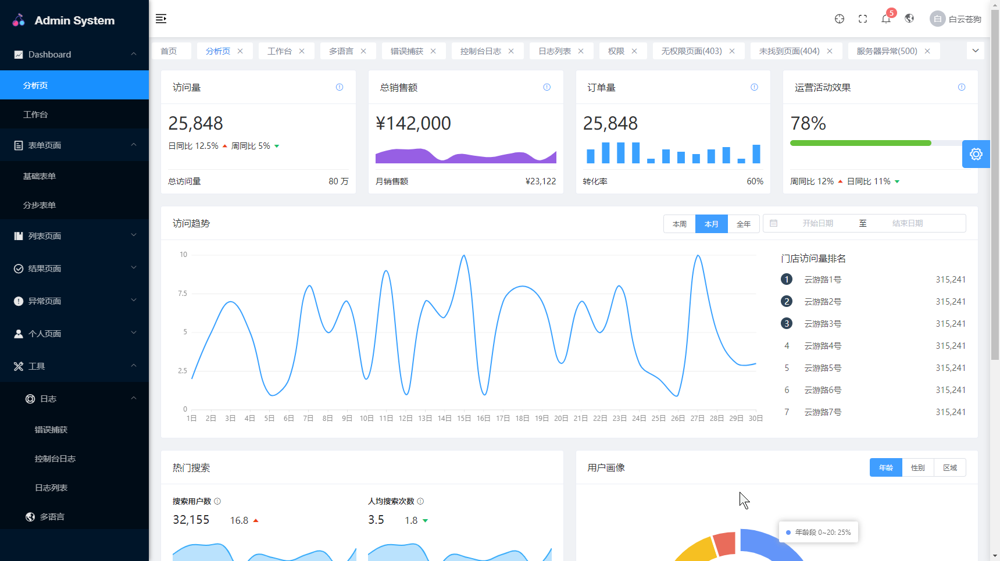
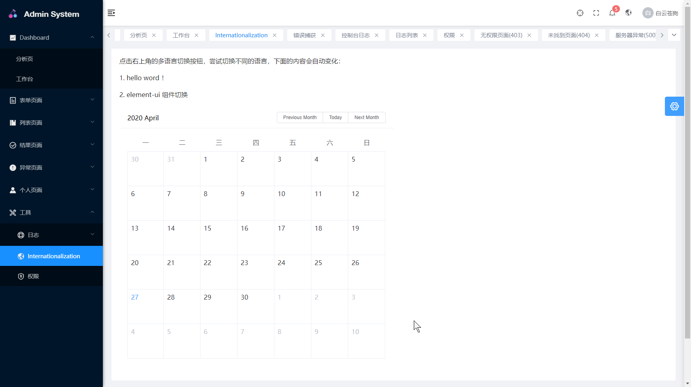
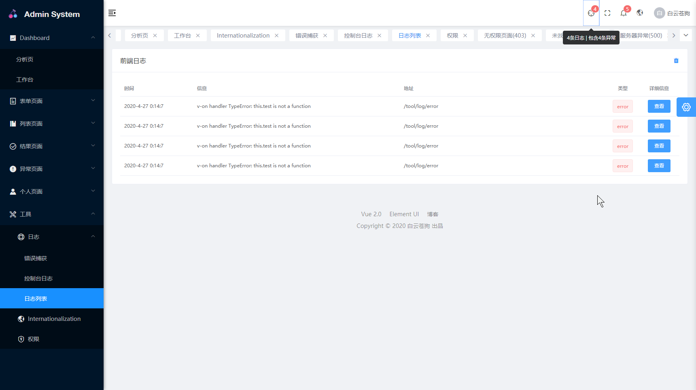
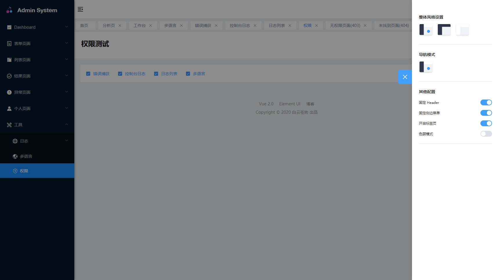
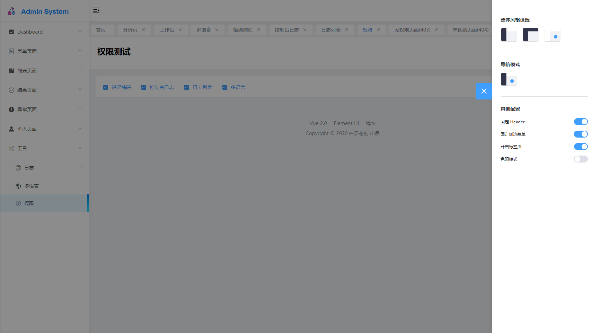

# Admin-Template #
后台项目模板 [演示地址](https://ml13.gitee.io/admin-template)

## 效果图 ##








## 主要用的使用依赖 ##
- vue          
- vuex         
- vue-router   
- vue-i18n     
- axios        
- element-ui   
- nprogress    
- antv/g2      
- screenfull

## 项目结构 ##

```
┌── public                     
│   ├── index.html             // html模板
│   ├── favicon.ico            // favicon图标
│ 
├── src                        // 源代码
│   ├── api                    // 所有请求
│   ├── assets                 // 静态资源
│   ├── components             // 全局公用组件
│   ├── config                 // 配置文件
│   ├── libs                   // 全局公用方法
│   ├── locale                 // 国际化 
│   ├── mock                   // 模拟数据
│   ├── plugin                 // vue插件
│   ├── router                 // 路由
│   ├── store                  // 全局 store管理
│   ├── views                  // view
│   ├── App.vue                // 入口页面
│   ├── index.less             // 全局样式
│   ├── main.js                // 入口 加载组件 初始化等
│ 
├── vue.config.js              // vue-cli 配置
├── .gitignore                 // git 忽略项
└── package.json               // package.json

```